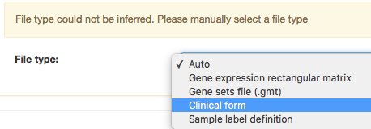
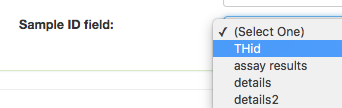
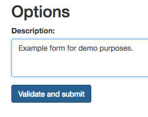

# HOWTO: Import a clinical form

A clinical form is a file containing clinical data about some samples in MedBook.

## Required File Format and Contents
Your form to import must be plain-text with tab-separated columns. (Comma-separated is not supported.)

The first line must be a header line, labeling each column.

There must be a column (with any label you like) that contains the Sample ID for that row.

### Sample ID format & requirements
The Sample ID for each row should be listed exactly as it appears in MedBook; 
however, it should NOT contain the Study prefix.
For example, if the Sample ID in MedBook is `demo/TEST_SAMPLE_1`, it should appear as `TEST_SAMPLE_1` in the form file.

The same sample may appear in multiple rows.
All samples in the form MUST be present in the same Study in MedBook. 
If there are any extra samples in the form, Wrangler will reject the import.

## The Import Process
Navigate to [the MedBook Wrangler tool](https://medbook.io/wrangler).

Choose "Create a new submission":

In the page that appears, choose Upload Local Files and select your form. 
Once it has been parsed, choose the file type "Clinical Form" in the menu that appears:

Further options will appear. Select the Study for this form, enter the Form name, and press "Enter". 
Then, when the Sample ID field appears, choose the column header that matches the one containing your sample IDs:

Your form will be reparsed with respect to the chosen Study to confirm that all samples in that form exist in the Study.
Once this is complete, your form is ready to submit.
Add a Description to the description field, and click Validate and submit to add your clinical form to the MedBook database:

Once submitted, you can view and share your form on the [Clinical Form management page](https://medbook.io/manage/clinical-forms).

